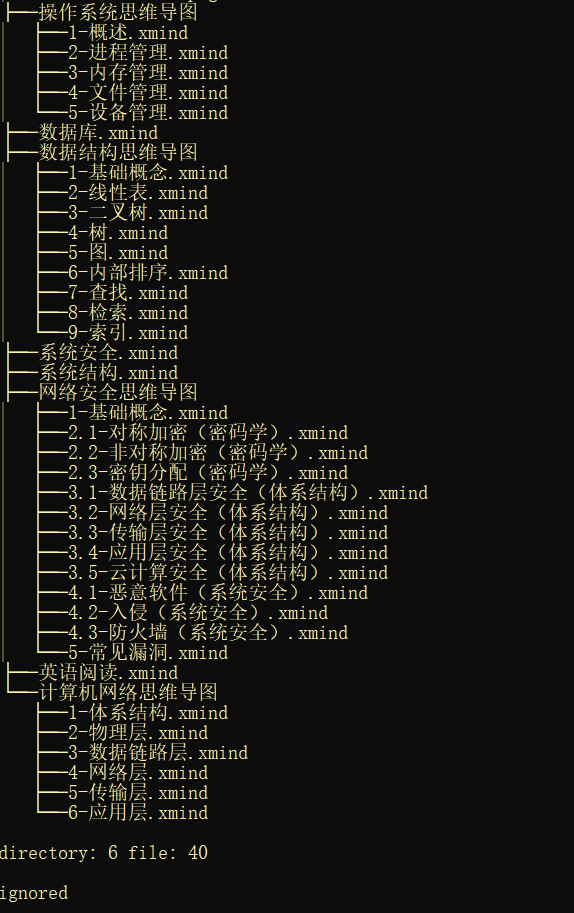

# CS Xmind

计算机&amp;网络安全专业思维导图（自制）

---

## 说明

- 部分导图只整理了我会考的内容，有些比较偏的内容没有整理；
- 知识一般都是用我自己的理解方式重新组织了语言，用于帮助理解知识点是个不错的选择
- 只建议将本仓库的导图用于参考，真正想学会知识还是要自己整理
- **推荐**：网络安全、计算机网络及数据结构自认为整理的很好，其中网安和计网很全，知识结构也很好

## 版权声明

**作者是：@1uvu，只用于交流分享，绝对不允许二次打包或者二次修改之后用于商业用途，且如果发布在其它渠道或者分享使用，必须经过本人同意，且要留下本仓库的 Entry。**

**License：[GPLv3](./LICENSE.md)**

## 目录结构

