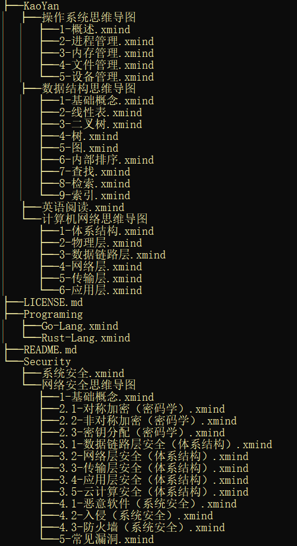

## 目录

- [考研](KaoYan)
- [安全](Security)
- [编程](Programing)

## 版权声明

**作者是：@1uvu，只用于交流分享，绝对不允许二次打包或者二次修改之后用于商业用途，且如果发布在其它渠道或者分享使用，必须经过本人同意，且要留下本仓库的 Entry。**

**License：[GPLv3](./LICENSE.md)**

## 目录结构

